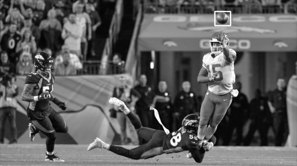
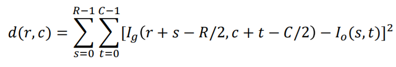

# Trabalho 2 - Localização de objeto com variação de iluminação

O trabalho 2 da disciplina de *Processamento Digital de Imagens* consiste em implementar um filtro capaz de localizar um objeto com iluminação diferente da imagem.

    
    

Em processamento de imagens, é possível detectar objetos em uma imagem por meio de uma função que calcula as diferenças quadráticas de cada pixel presente na imagem. Isso pode ser expresso por:

Dito isso, é possível que a iluminosidade do objeto a ser buscado na imagem esteja com uma iluminação diferente do que a da imagem. Assim, devem ser aplicadas transformações que tentam aproximar as iluminosidades, permitindo que o objeto seja então localizado.

A seguir, desenvolvemos um algoritmo capaz de realizar tal reconhecimento.

## Como executar

- Via linha de comando

A execução da localização de objetos deve seguir a seguinte forma:

`python search_object.py <caminho-da-imagem> <caminho-do-objeto> <claro | escuro>`

A tag claro ou escuro ajuda a obter uma melhor resposta, visto que pode haver confusão caso se escureça/clarifique demais a imagem.

- Via Jupyter Notebook

Também é possível rodas os scripts python pelo notebook python. Basta realizar o download da pasta e então, em linha de comando executar:

`jupyter notebook`

A seguir, adentre a pasta em que o arquivo `Localização de objeto com variação.ipynb` está localizado e execute as células do notebook.

### Ferramentas Utilizadas

- [Python v3.9.5](https://www.python.org/)
    - [Numpy v1.20.0](https://numpy.org/)
    - [Matplotlib v3.4.2](https://matplotlib.org/)
    - [Jupyter Notebook](https://jupyter.org/index.html)

### Referências

- Digital Image Processing, 4th Edition - Rafael C. Gonzales, Richard E. Woods.

## Autores

*Graduandos da Universidade Federal de São Carlos.*

- **Felipe Tavoni**

- **Gabriel Rodrigues Malaquias**

- **Lucas Cruz do Reis**

- **Renan Bobadilla Morelli**
