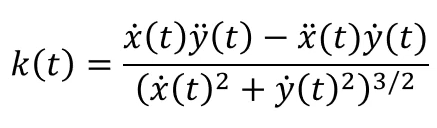

# Trabalho 3 - Cálculo da curvatura ao longo do contorno de objetos

O trabalho 3 da disciplina de *Processamento Digital de Imagens* consiste em utilizar a fórmula da curvatura para calcular um valor referente a curvatura para cada ponto do contorno, identificando picos positivos e negativos de curvatura.

A partir do c ́alculo dessa curvatura, mencionado em [1], podemos determinar oquanto o ponto se curva diante de uma reta. Podemos ter valores positivos ou negativos à medida que se percorre a fronteira no sentido horário, no qual valores positivos indicam que o ponto faz parte de um segmento *convexo*, enquanto o oposto  indica *concavidade*. Isso permite uma análise do contorno, podendo estimar o grau do mesmo, categorizando-o, por exemplo, como um ponto de canto o um ponto pertencente a uma reta.

## Como executar

- Via linha de comando

A execução da localização de objetos deve seguir a seguinte forma:

`python contorno.py <caminho-da-imagem>`

### Ferramentas Utilizadas

- [Python v3.9.5](https://www.python.org/)
    - [Numpy v1.20.0](https://numpy.org/)
    - [Matplotlib v3.4.2](https://matplotlib.org/)
    - [Jupyter Notebook](https://jupyter.org/index.html)

### Referências

- Digital Image Processing, 4th Edition - Rafael C. Gonzales, Richard E. Woods.

## Autores

*Graduandos da Universidade Federal de São Carlos.*

- **Felipe Tavoni**

- **Gabriel Rodrigues Malaquias**

- **Lucas Cruz do Reis**

- **Renan Bobadilla Morelli**
